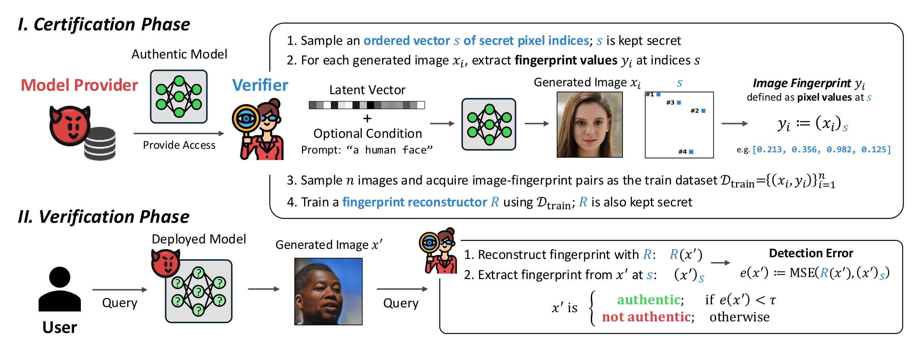

# AuthPrint: Fingerprinting Generative Models Against Malicious Model Providers

**Authors**: Kai Yao and Marc Juarez  
**Institution**: School of Informatics, University of Edinburgh, Edinburgh, UK  
**Contact**: kai.yao@ed.ac.uk, marc.juarez@ed.ac.uk

## Abstract

Generative models are increasingly adopted in high-stakes domains, yet current deployments offer no mechanisms to verify the origin of model outputs. We address this gap by extending model fingerprinting techniques beyond the traditional collaborative setting to one where the model provider may act adversarially. To our knowledge, this is the first work to evaluate fingerprinting for provenance attribution under such a threat model. The methods rely on a trusted verifier that extracts secret fingerprints from the model's output space, unknown to the provider, and trains a model to predict and verify them. Our empirical evaluation shows that our methods achieve near-zero FPR@95%TPR for instances of GAN and diffusion models, even when tested on small modifications to the original architecture and training data. Moreover, the methods remain robust against adversarial attacks that actively modify the outputs to bypass detection.

## Pipeline Overview



## Environment Setup

The project includes a Dockerfile that sets up all necessary dependencies. To build and run the container:

```bash
docker build -t authprint .
docker run --gpus all -it authprint
```

## Training

### StyleGAN2

To train the fingerprinting model on StyleGAN2:

```python
python scripts/train.py \
    --model_type stylegan2 \
    --stylegan2_url "https://nvlabs-fi-cdn.nvidia.com/stylegan2-ada-pytorch/pretrained/paper-fig7c-training-set-sweeps/ffhq70k-paper256-ada.pkl" \
    --stylegan2_local_path "ffhq70k-paper256-ada.pkl" \
    --img_size 256 \
    --batch_size 16 \
    --image_pixel_count 32 \
    --image_pixel_set_seed 42 \
    --total_iterations 100000 \
    --lr 1e-4 \
    --checkpoint_interval 10000
```

### Stable Diffusion

To train the fingerprinting model on Stable Diffusion:

```python
python scripts/train.py \
    --model_type stable-diffusion \
    --sd_model_name "stabilityai/stable-diffusion-2-1" \
    --img_size 1024 \
    --batch_size 32 \
    --total_iterations 5000000 \
    --checkpoint_interval 1000 \
    --image_pixel_count 64 \
    --image_pixel_set_seed 42 \
    --sd_num_inference_steps 25 \
    --sd_guidance_scale 7.5 \
    --sd_prompt "A photorealistic photo for a Japanese café named NOVA CAFE, with the name written clearly on a street sign, a storefront banner, and a coffee cup. The scene is set at night with neon lighting, rain-slick streets reflecting the glow, and people walking by in motion blur. Cinematic tone, Leica photo quality, ultra-detailed textures." \
    --sd_reconstructor_size "L" \
    --lr 1e-5 \
    --sd_enable_cpu_offload
```

## Evaluation

The evaluation scripts use the model checkpoint (.pth file) that was saved during the training phase containing the trained reconstructor. This checkpoint contains the trained reconstructor model weights and will be loaded for evaluation.

### StyleGAN2

To evaluate the fingerprinting model on StyleGAN2:

```python
python scripts/evaluate.py \
    --stylegan2_url "https://nvlabs-fi-cdn.nvidia.com/stylegan2-ada-pytorch/pretrained/paper-fig7c-training-set-sweeps/ffhq70k-paper256-ada.pkl" \
    --stylegan2_local_path "ffhq70k-paper256-ada.pkl" \
    --checkpoint_path '/path/to/checkpoint.pth' \
    --image_pixel_count 32 \
    --image_pixel_set_seed 42 \
    --num_samples 1024 \
    --batch_size 128
```

### Stable Diffusion

To evaluate the fingerprinting model on Stable Diffusion:

```python
python scripts/evaluate.py \
    --checkpoint_path "/path/to/checkpoint.pth" \
    --model_type "stable-diffusion" \
    --sd_model_name "stabilityai/stable-diffusion-2-1" \
    --sd_num_inference_steps 25 \
    --sd_guidance_scale 7.5 \
    --sd_enable_cpu_offload \
    --sd_prompt "A photorealistic photo for a Japanese café named NOVA CAFE, with the name written clearly on a street sign, a storefront banner, and a coffee cup. The scene is set at night with neon lighting, rain-slick streets reflecting the glow, and people walking by in motion blur. Cinematic tone, Leica photo quality, ultra-detailed textures." \
    --img_size 1024 \
    --image_pixel_count 64 \
    --image_pixel_set_seed 42 \
    --num_samples 256 \
    --batch_size 32 \
    --sd_reconstructor_size "L" \
    --no_pruning
```

## Project Structure

- `config/`: Configuration files
- `evaluators/`: Evaluation code
- `models/`: Model implementations
- `scripts/`: Training and evaluation scripts
- `trainers/`: Training code
- `utils/`: Utility functions